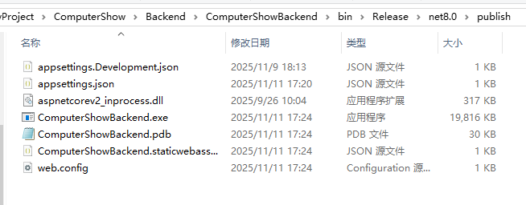
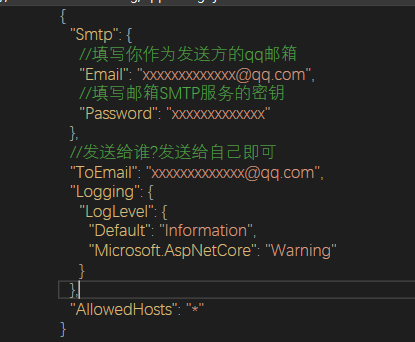
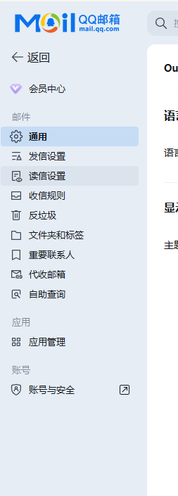
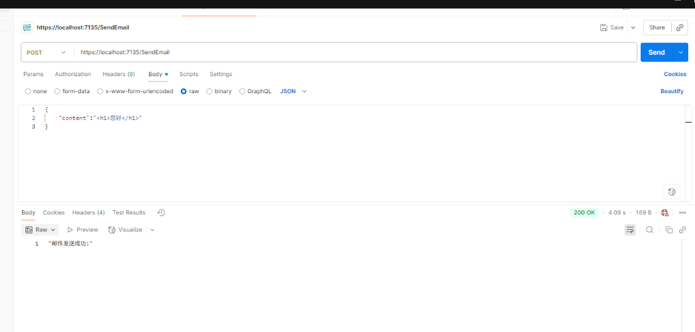


## 💻 后端使用教程

### 一、文件结构

下载并解压后端程序后，可以看到如下文件夹结构：


### 二、主要文件说明

本项目中需要重点关注以下两个文件：

#### 1️⃣ `appsettings.json`

该文件为 **SMTP 邮件服务配置文件**，用于指定邮箱服务器、端口、用户名及授权码等参数。

示例：


##### 授权码（Password）获取流程

1. 登录 QQ 邮箱
2. 点击左侧的「账号与安全」
   
3. 进入「安全设置」页
4. 生成邮箱授权码，并将其填写到 `appsettings.json` 的 `Password` 字段中
   

> ⚠️ 注意：QQ 邮箱的授权码并非邮箱密码。请妥善保管授权码，避免泄露。

---

#### 2️⃣ `ComputerShowBackend.exe`

这是 **后端程序启动文件**。
配置完成后，双击运行该文件即可启动服务。

程序启动后，会打开一个控制台窗口，并显示当前使用的端口号。
例如：

```
Server started on http://localhost:5000
```

---

### 三、接口测试（以发送邮件 API 为例）

后端启动后，即可访问发送邮件接口。
以下使用 **Postman** 进行测试演示：


#### ✅ 请求说明

| 项目           | 内容                              |
| ------------ | ------------------------------- |
| 请求方法         | POST                            |
| 请求地址         | `http://<主机地址>:<端口号>/sendemail` |
| Content-Type | `application/json`              |
| 请求体          | JSON 格式，参数如下：                   |

| 参数名     | 类型     | 必填 | 说明                |
| ------- | ------ | -- | ----------------- |
| content | string | 是  | 邮件正文内容，支持 HTML 格式 |

**示例：**

```json
{
  "content": "<h1>你好</h1><p>这是一封测试邮件。</p>"
}
```

发送后若返回：

```
"邮件发送成功"
```

则说明接口调用成功、邮件已发送。

---

### 四、注意事项

* 若发送失败，请检查：

  * `appsettings.json` 配置是否正确；
  * 邮箱授权码是否有效；
  * SMTP 服务端口是否被防火墙或安全软件拦截；
* 可在控制台查看日志输出，定位错误原因。

